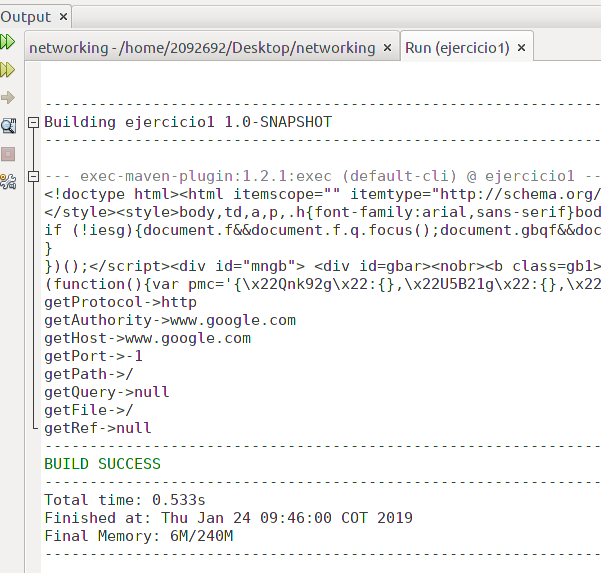
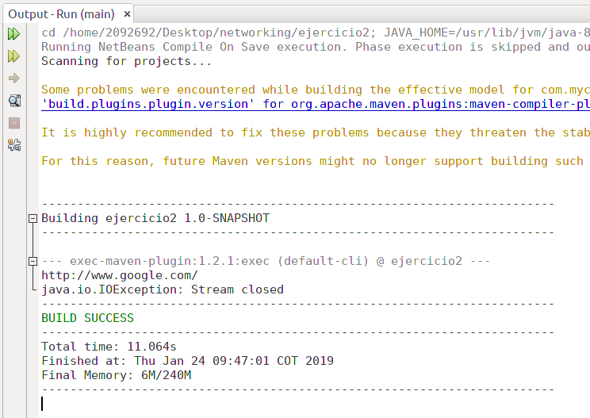
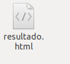
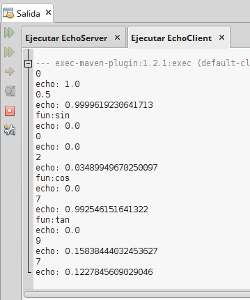

# Networking

# URLs

- Ejercicio 1
Escriba un programa en el cual usted cree un objeto URL e imprima en pantalla cada uno de los datos que retornan los 8 métodos.

- Ejercicio 2
Escriba una aplicación browser que pregunte una dirección URL al usuario y que lea datos de esa dirección y que los almacene en un archivo con el nombre resultado.html. Luego intente ver este archivo en el navegador.

# Sockets

- Ejercicio 4.3.1 -> Escriba un servidor que reciba un número y responda el cuadrado de este número.

- Ejercicio 4.3.2-> Escriba un servidor que pueda recibir un número y responda con un operación sobre este número. Este servidor puede recibir un mensaje que empiece por “fun:”, si recibe este mensaje cambia la operación a las especificada. El servidor debe responder las funciones seno, coseno y tangente. Por defecto debe empezar calculando el coseno. Por ejemplo, si el primer número que recibe es 0, debe responder 1, si después recibe ⇡/2 debe responder 0, si luego recibe “fun:sin” debe cambiar la operación actual a seno, es decir a a partir de ese momento debe calcular senos. Si enseguida recibe 0 debe responder 0.

- Ejercicio 4.5.1 -> Escriba un servidor web que soporte múltiples solicitudes seguidas (no concurrentes). El servidor debe retornar todos los archivos solicitados, incluyendo páginas html e imágenes.

# Datagramas

- Ejercicio 5.2.1 -> Utilizando Datagramas escriba un programa que se conecte a un servidor que responde la hora actual en el servidor. El programa debe actualizar la hora cada 5 segundos según los datos del servidor. Si una hora no es recibida debe mantener la hora que tenía. Para la prueba se apagar´a el servidor y después de unos segundos se reactivar´a. El cliente debe seguir funcionando y actualizarse cuando el servidor este nuevamente funcionando.

Laboratorio N°2 ARSW ---Karen Mora---
