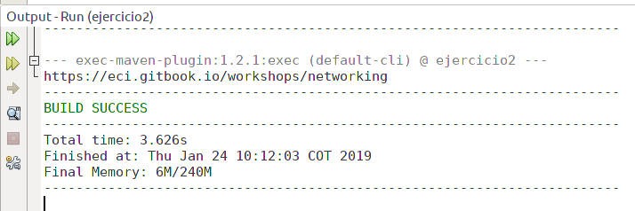

# Networking

# URLs

- Ejercicio 1
Write a program in which you create a URL object and print on the screen each of the data returned by the 8 methods.

- Ejercicio 2
Write a browser application that asks a user's URL and reads that address and stores it in a file with the name result.html. Then try to see this file in the browser.or.

# Sockets

- Ejercicio 4.3.1 -> Write a server that receives a number and answers the square of this number.

- Ejercicio 4.3.2-> Write a server that can receive a number and respond with an operation on this number. This server can receive a message that begins with "fun:", if it receives this message it changes the operation to the speci fi ed ones. The server must answer the sine, cosine and tangent functions. By default you must start by calculating the cosine. For example, if the first number you receive is 0, you must answer 1, if you then receive ⇡ / 2 you must answer 0, if you then receive "fun: without" you must change the current operation to sine, that is to say from that moment you must calculate breasts. If you immediately receive 0 you must answer 0.

Laboratorio N°2 ARSW ---Karen Mora---
